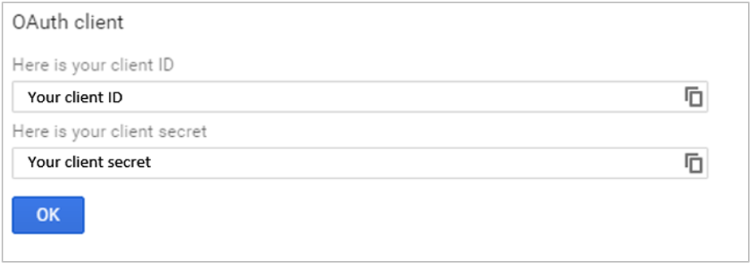

# Google Single Sign-On (E20) 
___

Follow these steps to configure Mattermost to use Google as a single sign-on (SSO) service for team creation, account creation and sign-in.

**Note: Google SSO is not yet supported in the mobile app. If you want to use Google SSO on mobile, you'll have to [build your own app](https://developers.mattermost.com/contribute/mobile/build-your-own/).**

1 - Go to [Google API Manager](https://console.developers.google.com), click **Credentials** in the left hand sidebar, click **Create a project** and enter "Mattermost - your-company-name" as the **Project Name**, then click **Create**.

2 - In the **Dashboard** click the option to **ENABLE APIS AND SERVICES** 

Once in the API Library scroll down to [Google+ API](https://console.developers.google.com/apis/api/plus/overview) and click **Enable** in the header. This might take a few minutes to propagate through Google's systems.

3 - Leave the Google+ API menu and return to the **APIs & Services menu** and in the left hand sidebar select **Credentials**, click the **OAuth consent screen** header and enter "Mattermost" as the **Product name shown to users**, then click **Save**.

Scroll further down and you will need to add the domain used by your Mattermost instance to a list that is authorised to access the API. For example if it is hosted on `mattermost.yourdomain.com` you would add `yourdomain.com`.

4 - Select **Credentials** and click **Create credentials**, choose **OAuth client ID** from the drop-down list.

5 - Select **Web Application** as the **Application type**, and choose a descriptive **Name** for the OAuth connection. 

Under **Restrictions** > **Authorized redirect URIs**, enter `your-mattermost-url/signup/google/complete` (example: `http://localhost:8065/signup/google/complete`). Click **Create**.

6 - Copy the **Client ID** and **Client Secret**, which will be used to configure Google SSO for Mattermost.

8 - In **System Console > OAuth 2.0 > Select OAuth 2.0 service provider**, choose **Google Apps** as the service provider and enter **Client ID** and **Client Secret** from step 6 in their respective fields.

9 - Restart your Mattermost server to see the changes take effect.

Notes: 
- You may also enter **Client ID** and **Client Secret** fields from step 6 directly in `GoogleSettings` section of `config/config.json`.
- The following default values in `GoogleSettings` section of `config/config.json` are recommended:
    - `Scope`: `profile email`
    - `AuthEndpoint`: `https://accounts.google.com/o/oauth2/v2/auth` 
    - `TokenEndpoint`: `https://www.googleapis.com/oauth2/v4/token`  
    - `UserApiEndpoint`: `https://www.googleapis.com/plus/v1/people/me`  
