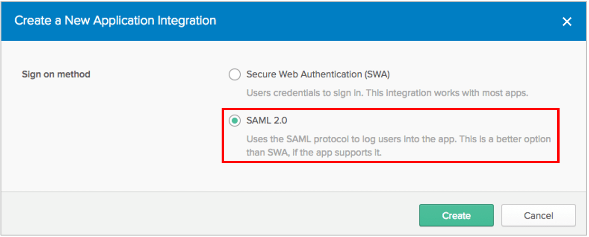
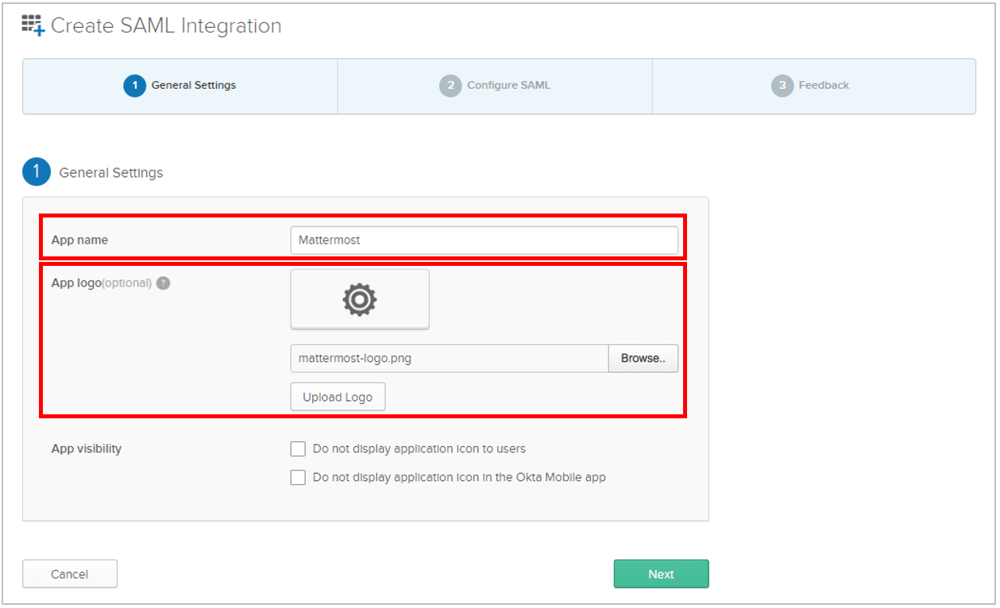
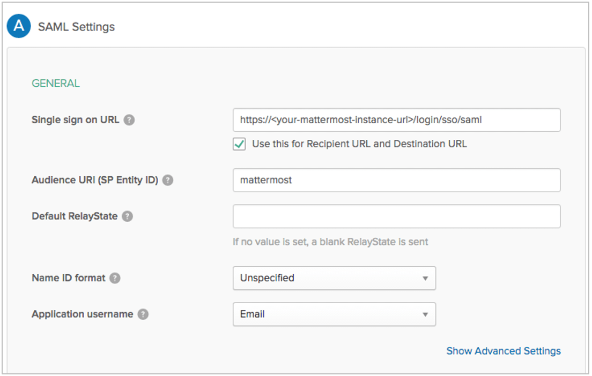
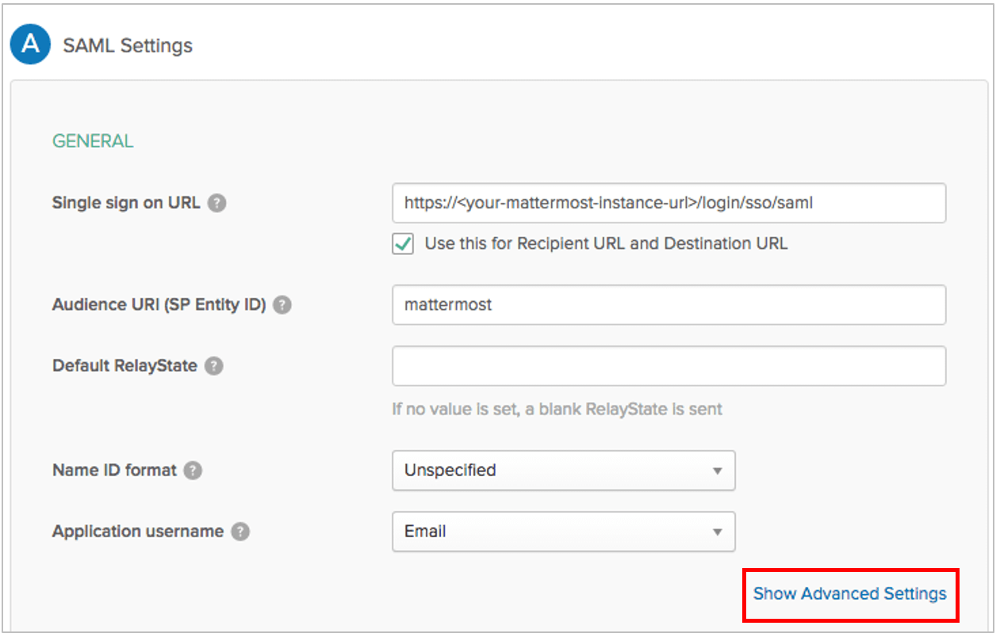
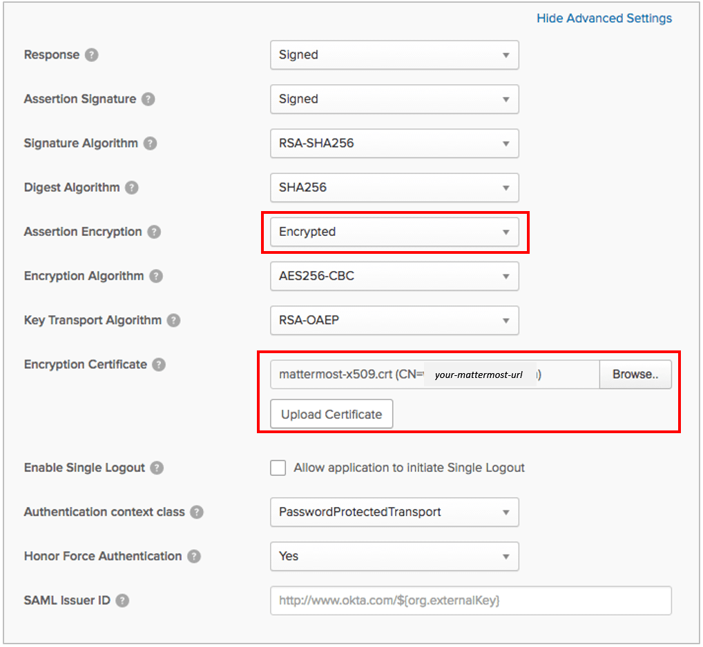
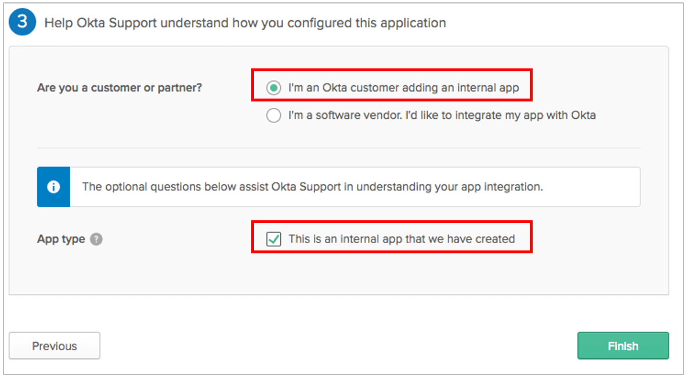
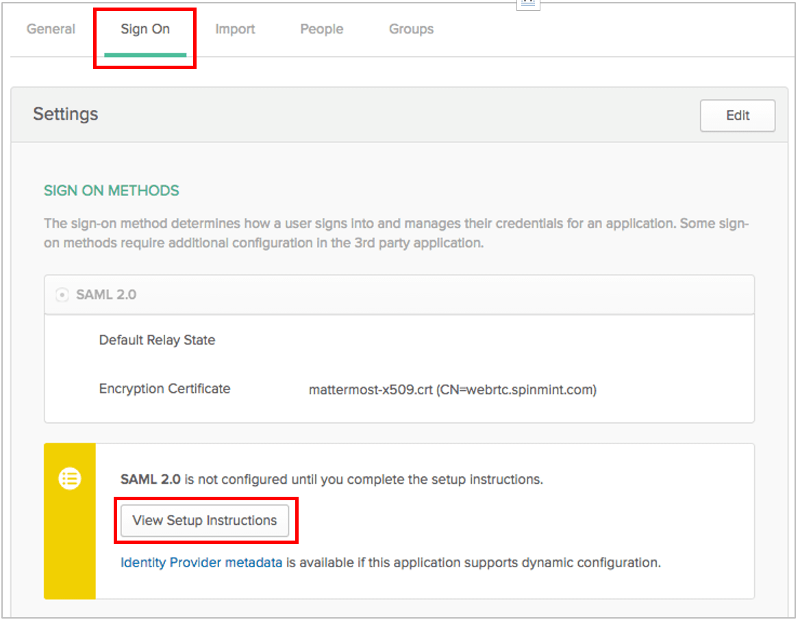
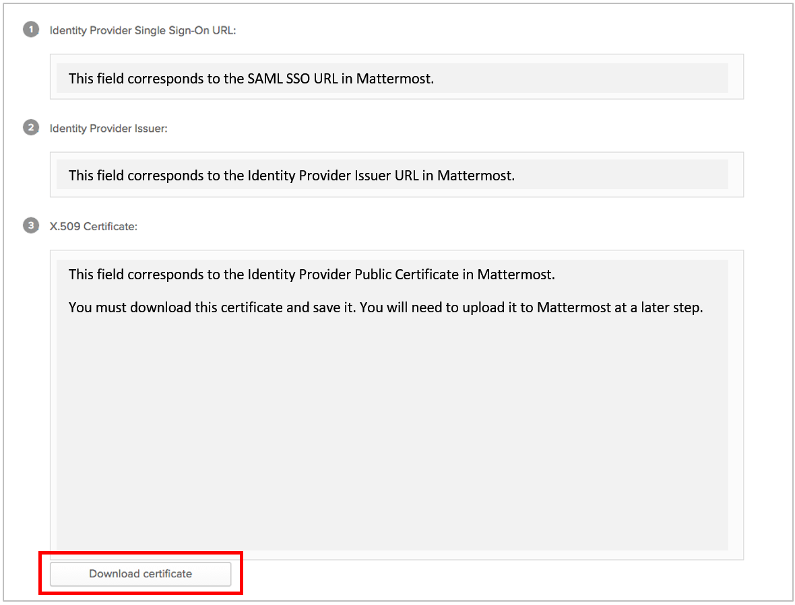
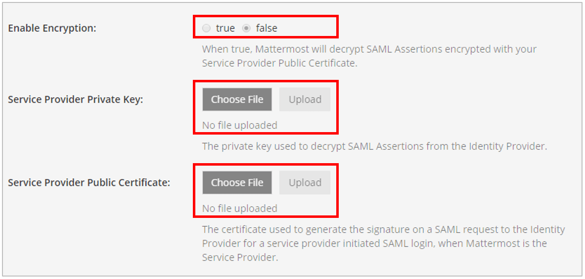

## Configure SAML with Okta

The following process provides steps to configure SAML with Okta for Mattermost.

### Set up a connection app for Mattermost SSO

1) Sign into Okta as an administrator.

2) Go to **Admin Dashboard > Applications > Add Application**.

3) Click **Create New App** and choose `SAML 2.0` as the Sign on method.

4) Enter **General Settings** for the application, including `App name` and `App logo` (optional). It is recommended to display the application icon to users, including in the Okta Mobile app.

If you’d like to use a Mattermost logo for the application, you are free to download one [here](../../source/images/okta_mattermost_logo.PNG)

5) Enter **SAML Settings**, including:
 - Single sign on URL: `https://<your-mattermost-url>/login/sso/saml`
 - Audience URL: For instance, `mattermost`
 - Name ID format: `unspecified`
 - Application username: `Email`

6) (Optional) Set up encryption for your SAML connection. First, click **Show Advanced Settings**

Then, set **Assertion Encryption** as `Encrypted` and generate the encryption certificates. You are free to generate the certificates by [downloading a built script here](broken link, to be added).

After generating your x509.crt encryption certificate, upload it to **Encryption Certificate** field.

7) Enter attribute statements, which will be used to map attributes between Okta and Mattermost. For more information on which attributes are configurable, see our [documentation on SAML configuration settings](http://docs.mattermost.com/administration/config-settings.html#saml-enterprise). Email, first name, last name and username attributes are required.

8) Click **Next**. Then, set Okta support parameters for the application. Recommended settings:
 - I’m an Okta customer adding an internal app
 - This is an internal app that we have created

9) Click **Finish**. On the next screen, click the **Sign On** tab and click **View Setup Instructions**.

10) Take note of `Identity Provider Single Sign-On URL` (also known as `SAML SSO URL`), and the Identity Provider Issuer, as both will be needed to configure SAML for Mattermost. 

Furthermore, you **must download the X.509 Public Certificate file** and save it. You will need to upload it to Mattermost at a later step.

##### Configure SAML for Mattermost

11) Start Mattermost server and sign into Mattermost as a System Administrator. Go to **System Console > Authentication > SAML**, and enter the following fields:
 - **SAML SSO URL**: `Identity Provider Single Sign-On URL` from Okta, specified in step 10.
 - **Identity Provider Issuer URL**: `Identity Provider Issuer` from Okta, specified in step 10.
 - **Identity Provider Public Certificate**: X.509 Public Certificate file you downloaded from Okta in step 10.

12) (Optional) Configure Mattermost to verify the signature. The **Service Provider Login URL** is the `Single sign on URL` you specified in Okta in step 5.

13) (Optional) Enable encryption based on the parameters provided in step 6.

14) Set attributes for the SAML Assertions, which will be used to update user information in Mattermost. Attributes for email, username, first name and last name are required and should match the values you entered in Okta in step 7. See [documentation on SAML configuration settings](http://docs.mattermost.com/administration/config-settings.html#saml-enterprise) for more detail.

15) (Optional) Lastly, customize the login button text.

16) Click **Save**.

You’re done! If you’d like to confirm SAML SSO is successfully enabled, switch your System Administrator account from email to SAML-based authentication via **Account Settings > General > Sign-in Method > Switch to SAML SSO** and sign in with your SAML credentials to complete the switch.

It is also recommended to post an announcement about how the migration will work to users.

You may also configure SAML for Okta by editing `config.json`. Before starting the Mattermost server, edit `config.json` to enable SAML based on [SAML configuration settings](http://docs.mattermost.com/administration/config-settings.html#saml-enterprise). After starting the Mattermost server, the first user to log in with valid SAML credentials will be assigned the System Administrator role.
