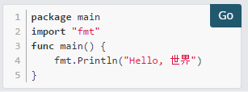
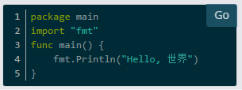
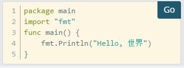
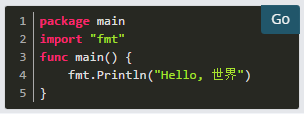
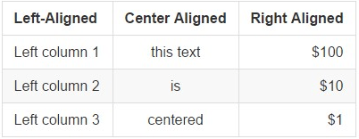
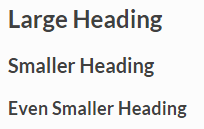

# Formatting Text  
_____

Markdown makes it easy to format messages. Type a message as you normally would, and use these rules to render it with special formatting. 

## Text Style 

You can use either `_` or `*` around a word to make it italic. Use two to make it bold.

* `_italics_` renders as _italics_
* `**bold**` renders as **bold**
* `**_bold-italic_**` renders as **_bold-italics_**
* `~~strikethrough~~` renders as ~~strikethrough~~

## Code Block 

Create a code block by indenting each line by four spaces, or by placing ``` on the line above and below your code. 

Example:

    ```
    code block
    ```

Renders as: 
```
code block
```

### Syntax Highlighting

To add syntax highlighting, type the language to be highlighted after the ``` at the beginning of the code block. Mattermost also offers four different code themes (GitHub, Solarized Dark, Solarized Light, Monokai) that can be changed in **Account Settings** > **Display** > **Theme** > **Custom Theme** > **Center Channel Styles** 

Supported languages are:
`as`, `applescript`, `osascript`, `scpt`, `bash`, `sh`, `zsh`, `clj`, `boot`, `cl2`, `cljc`, `cljs`, `cljs.hl`, `cljscm`, `cljx`, `hic`, `coffee`, `_coffee`, `cake`, `cjsx`, `cson`, `iced`, `cpp`, `c`, `cc`, `h`, `c++`, `h++`, `hpp`, `cs`, `csharp`, `css`, `d`, `di`, `dart`, `delphi`, `dpr`, `dfm`, `pas`, `pascal`, `freepascal`, `lazarus`, `lpr`, `lfm`, `diff`, `django`, `jinja`, `dockerfile`, `docker`, `erl`, `f90`, `f95`, `fsharp`, `fs`, `gcode`, `nc`, `go`, `groovy`, `handlebars`, `hbs`, `html.hbs`, `html.handlebars`, `hs`, `hx`, `java`, `jsp`, `js`, `jsx`, `json`, `jl`, `kt`, `ktm`, `kts`, `less`, `lisp`, `lua`, `mk`, `mak`, `md`, `mkdown`, `mkd`, `matlab`, `m`, `mm`, `objc`, `obj-c`, `ml`, `perl`, `pl`, `php`, `php3`, `php4`, `php5`, `php6`, `ps`, `ps1`, `pp`, `py`, `gyp`, `r`, `ruby`, `rb`, `gemspec`, `podspec`, `thor`, `irb`, `rs`, `scala`, `scm`, `sld`, `scss`, `st`, `sql`, `swift`, `tex`, `vbnet`, `vb`, `bas`, `vbs`, `v`, `veo`, `xml`, `html`, `xhtml`, `rss`, `atom`, `xsl`, `plist`, `yaml`

Example:

    ``` go
    package main
    import "fmt"
    func main() {
	    fmt.Println("Hello, 世界")
    }
    ```

Renders as: 

**GitHub Theme**    

 

**Solarized Dark Theme**    

 

**Solarized Light Theme**    

 

**Monokai Theme**    

 


## In-line Code

Create in-line monospaced font by surrounding it with backticks. 
```
`monospace`
```
Renders as: `monospace`.

## Links  

Create labeled links by putting the desired text in square brackets and the associated link in normal brackets. 

`[Check out Mattermost!](https://about.mattermost.com/)`

Renders as: [Check out Mattermost!](https://about.mattermost.com/)

## In-line Images  

Create in-line images using an `!` followed by the alt text in square brackets and the link in normal brackets. Add hover text by placing it in quotes after the link.
```


and

[](https://travis-ci.org/mattermost/platform) [](https://github.com/mattermost/platform)
```
Renders as: 


and

[](https://travis-ci.org/mattermost/platform) [](https://github.com/mattermost/platform)

## Emojis  

Open the emoji autocomplete by typing `:`. A full list of emojis can be found [here](http://www.emoji-cheat-sheet.com/). It is also possible to create your own [Custom Emoji](http://docs.mattermost.com/help/settings/custom-emoji.html) if the emoji you want to use doesn't exist.

```
:smile: :+1: :sheep:
```
Renders as:  


## Lines  

Create a line by using three `*`, `_`, or `-`.

`***` renders as: 
***

## Block quotes  

Create block quotes using `>`.

`> block quotes` renders as:


## Lists  

Create a list by using `*` or `-` as bullets. Indent a bullet point by adding two spaces in front of it.
```
* list item one
* list item two
  * item two sub-point
```
Renders as: 
* list item one
* list item two
  * item two sub-point

Make it an ordered list by using numbers instead:
```
1. Item one
2. Item two
```
Renders as: 
1. Item one
2. Item two

Make a task list by including square brackets:
```
- [ ] Item one
- [ ] Item two
- [x] Completed item
```
Renders as:  


## Tables  

Create a table by placing a dashed line under the header row and separating the columns with a pipe `|`. (The columns don’t need to line up exactly for it to work). Choose how to align table columns by including colons `:` within the header row.
```
| Left-Aligned  | Center Aligned  | Right Aligned |
| :------------ |:---------------:| -----:|
| Left column 1 | this text       |  $100 |
| Left column 2 | is              |   $10 |
| Left column 3 | centered        |    $1 |
```

Renders as:



## Headings  

Make a heading by typing # and a space before your title. For smaller headings, use more #’s. 
```
## Large Heading
### Smaller Heading
#### Even Smaller Heading
```
Renders as:  



Alternatively, you can underline the text using `===` or `---` to create headings.
```
Large Heading
-------------
```
Renders as:  


